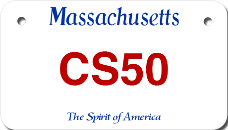

# Vanity Plates



In Massachusetts, home to Harvard University, it’s possible to request a vanity license plate for your car, with your choice of letters and numbers instead of random ones. Among the requirements, though, are:

- “All vanity plates must start with at least two letters.”
- “… vanity plates may contain a maximum of 6 characters (letters or numbers) and a minimum of 2 characters.”
- “Numbers cannot be used in the middle of a plate; they must come at the end. For example, AAA222 would be an acceptable … vanity plate; AAA22A would not be acceptable. The first number used cannot be a ‘0’.”
- “No periods, spaces, or punctuation marks are allowed.”
In `plates.py`, implement a program that prompts the user for a vanity plate and then output `Valid` if meets all of the requirements or `Invalid` if it does not. Assume that any letters in the user’s input will be uppercase. Structure your program per the below, wherein `is_valid` returns `True` if `s` meets all requirements and `False` if it does not. Assume that `s` will be a `str`. You’re welcome to implement additional functions for `is_valid` to call (e.g., one function per requirement).

```python
def main():
    plate = input("Plate: ")
    if is_valid(plate):
        print("Valid")
    else:
        print("Invalid")


def is_valid(s):
    ...


main()
```

## Hints

- Recall that a str comes with quite a few methods, per docs.python.org/3/library/stdtypes.html#string-methods.
- Much like a `list`, a `str` is a “sequence” (of characters), which means it can be “sliced” into shorter strings with syntax like `s[i:j]`. For instance, if s is "CS50", then `s[0:2]` would be "`CS`".


## Demo

```bash
$ python  plates.py
Plate: HELLO, WORLD
Invalid
$ python plates.py
Plate: GOODBYE
Invalid
$ python plates.py
Plate: CS50
Valid
$ python plates.py
Plate: CS05
Invalid
$ python plates.py
Plate: 50
Invalid
```

## How to Test

Here’s how to test your code manually:

- Run your program with python `plates.py`. Type `CS50` and press Enter. Your program should output:

```bash
Valid
```

- Run your program with python `plates.py`. Type `CS05` and press Enter. Your program should output:

```bash
Invalid
```

- Run your program with python `plates.py`. Type `CS50P` and press Enter. Your program should output

```bash
Invalid
```

- Run your program with python `plates.py`. Type `PI3.14` and press Enter. Your program should output

```bash
Invalid
```

- Run your program with python `plates.py`. Type `H` and press Enter. Your program should output

```bash
Invalid
```

- Run your program with python `plates.py`. Type `OUTATIME` and press Enter. Your program should output

```bash
Invalid
```
