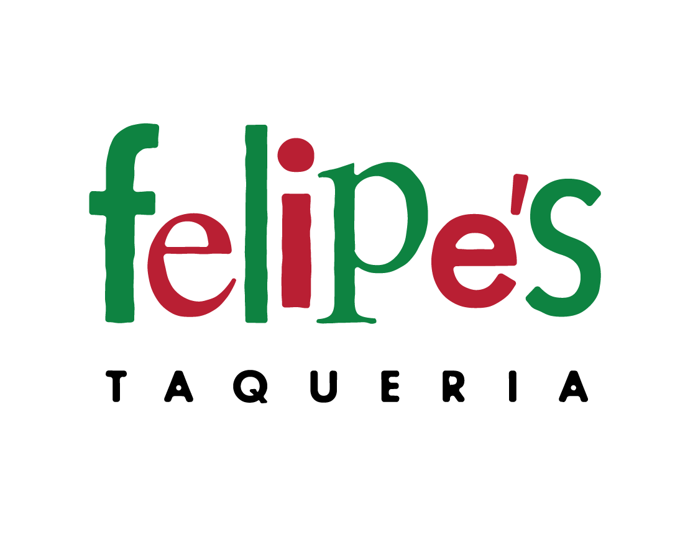

# Felipe's Taqueria



One of the most popular places to eat in Harvard Square is Felipe’s Taqueria, which offers a menu of entrees, per the dict below, wherein the value of each key is a price in dollars:

```python
{
    "Baja Taco": 4.00,
    "Burrito": 7.50,
    "Bowl": 8.50,
    "Nachos": 11.00,
    "Quesadilla": 8.50,
    "Super Burrito": 8.50,
    "Super Quesadilla": 9.50,
    "Taco": 3.00,
    "Tortilla Salad": 8.00
}
```

In a file called `taqueria.py`, implement a program that enables a user to place an order, prompting them for items, one per line, until the user inputs control-d (which is a common way of ending one’s input to a program). After each inputted item, display the total cost of all items inputted thus far, prefixed with a dollar sign `($)` and formatted to two decimal places. Treat the user’s input case insensitively. Ignore any input that isn’t an item. Assume that every item on the menu will be titlecased.

## Hints

- Note that you can detect when the user has inputted control-d by catching an `EOFError` with code like:

```python
try:
    item = input()
except EOFError:
    ...
```

You might want to print a new line so that the user’s cursor (and subsequent prompt) doesn’t remain on the same line as your program’s own prompt.

- Inputting control-d does not require inputting Enter as well, and so the user’s cursor (and subsequent prompt) might thus remain on the same line as your program’s own prompt. You can move the user’s cursor to a new line by printing `\n` yourself!

- Note that a `dict` comes with quite a few methods, per docs.python.org/3/library/stdtypes.html#mapping-types-dict, among them `get`, and supports operations like:

```python
d[key]
```

and

```python
if key in d:
    ...
```

wherein d is a dict and key is a str.

Be sure to avoid or catch any `KeyError`.

## Demo

```bash
$ python taqueria.py
Item: %burrito
Total: $7.50
Item: large quesadilla
Item: super quesadilla
Total: $17.00
Item:
$ python taqueria.py
Item: nachos
Total: $11.00
Item: taco
Total: $14.00
Item: taco
Total: $20.00
Item: 
```

## How to Test

Here’s how to test your code manually:

- Run your program with `python taqueria.py`. Type `Taco` and press Enter, then type Taco again and press Enter. Your program should output:

```bash
Total: $6.00  
```

and continue prompting the user until they input control-d.

- Run your program with `python taqueria.py`. Type `Baja Taco` and press Enter, then type Tortilla Salad and press enter. Your program should output:

```bash
Total: $12.00
```

and continue prompting the user until they input control-d.

- Run your program with `python taqueria.py`. Type `Burger` and press Enter. Your program should reprompt the user.