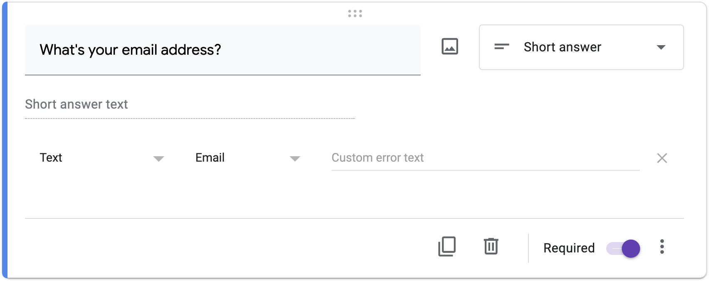

# Response Validation

When creating a Google Form that prompts users for a short answer (or paragraph), it’s possible to enable response validation and require that the user’s input match a regular expression. For instance, you could require that a user input an email address with a regex like this one:

```bash
^[a-zA-Z0-9.!#$%&'*+\/=?^_`{|}~-]+@[a-zA-Z0-9](?:[a-zA-Z0-9-]{0,61}[a-zA-Z0-9])?(?:\.[a-zA-Z0-9](?:[a-zA-Z0-9-]{0,61}[a-zA-Z0-9])?)*$
```

Or you could more easily use Google’s built-in support for validating an email address, per the screenshot below, much like you could use a library in your own code:



In a file called `response.py`, using either validator-collection or validators from PyPI, implement a program that prompts the user for an email address via `input` and then prints `Valid` or `Invalid`, respectively, if the input is a syntatically valid email address. You may not use `re`. And do not validate whether the email address’s domain name actually exists.

## Hints

- Note that you can install validator-collection with:

```bash
pip install validator-collection
```

Click **Homepage** to find your way to the library’s documentation.

- Note that you can install validators with:

```bash
pip install validators
```

Click **Homepage** to find your way to the library’s documentation.

## Demo

```bash
$ python response.py                                                            
What's your email address? malan                                                
Invalid                                                                         
$ python response.py                                                            
What's your email address? malan at harvard dot edu                             
Invalid                                                                         
$ python response.py                                                            
What's your email address? malan@harvard.edu                                    
Valid 
```

## How to Test

Here’s how to test your code manually:

- Run your program with `python response.py`. Ensure your program prompts you for an email, then type `malan@harvard.edu`, followed by Enter. Your program should output `Valid`.
- Run your program with `python response.py`. Type your own email, followed by Enter. Your program should output `Valid`.
- Run your program with `python response.py`. Type malan@@@harvard.edu, followed by Enter. Your program should output `Invalid`.
- Run your program with `python response.py`. Mistype your own email, including an extra . before .com, for example. Press enter and your program should output `Invalid`.