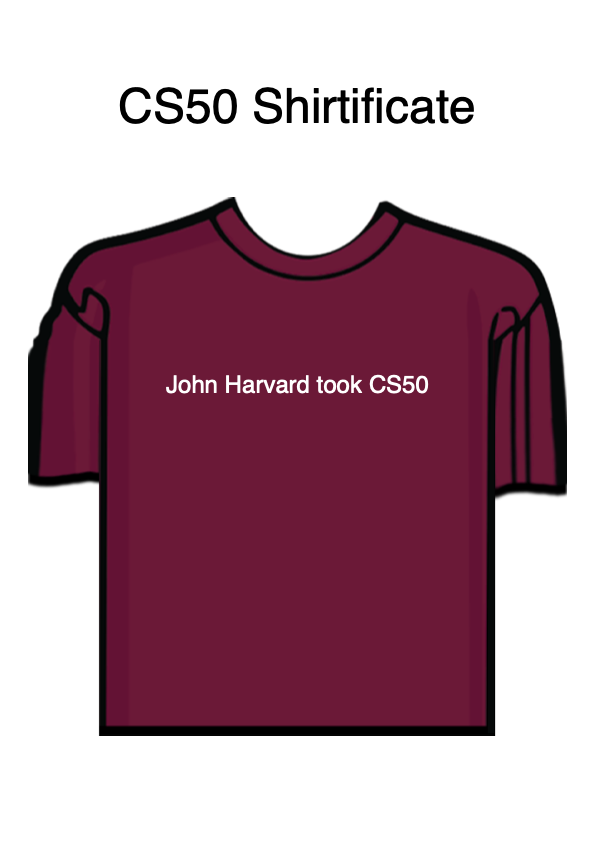

# CS50 Shirtificate



Suppose that you’d like to implement a CS50 “shirtificate,” a PDF with an image of an I took CS50 t-shirt, shirtificate.png, customized with a user’s own name.

In a file called `shirtificate.py`, implement a program that prompts the user for their name and outputs, using fpdf2, a CS50 shirtificate in a file called `shirtificate.pdf` similar to this one for John Harvard, with these specifications:

- The orientation of the PDF should be Portrait.
- The format of the PDF should be A4, which is 210mm wide by 297mm tall.
- The top of the PDF should say “CS50 Shirtificate” as text, centered horizontally.
- The shirt’s image should be centered horizontally.
- The user’s name should be on top of the shirt, in white text.
All other details we leave to you. You’re even welcome to add borders, colors, and lines. Your shirtificate needn’t match John Harvard’s precisely. And no need to wrap long names across multiple lines.

Before writing any code, do read through fpdf2’s tutorial to learn how to use it. Then skim fpdf2’s API (application programming interface) to see all of its functions and parameters therefor.

No need to submit any PDFs with your code. But, if you would like, you’re welcome (but not expected) to share a shirtificate with your name on it in any of CS50’s communities!

## Hints

- Note that fpdf2 comes with a `class` called `FPDF`, which has quite a few methods, per pyfpdf.github.io/fpdf2/fpdf/#fpdf.FPDF. You can install it with:

```bash
pip install fpdf2
```

- Note that you can extend `FPDF` and instantiate your own subclass thereof in order to add a header to every page of a PDF, per pyfpdf.github.io/fpdf2/Tutorial.html#tuto-2-header-footer-page-break-and-image. Or you can add it as text yourself.
- Note that you can disable automatic page breaks, which might otherwise cause your PDF to overflow from one page to two, with set_auto_page_break, per pyfpdf.github.io/fpdf2/Margins.html.
- Note that a cell’s height can be negative, to move it upward.
You can open `shirtificate.pdf`, once outputted, by clicking it in VS Code’s file explorer.

## Demo

```bash
$ python shirtificate.py                                                        
Name: John Harvard 
```

## How to Test

Here’s how to test your code manually:

- Run your program with `shirtificate.py`. Make sure your program prompts you for a name. Enter your own name and press Enter. Your program should create a file, `shirtificate.pdf`, containing the name you entered as input overlaid on a rendering of `shirtificate.png`.
- Try a few other names for good measure, too!