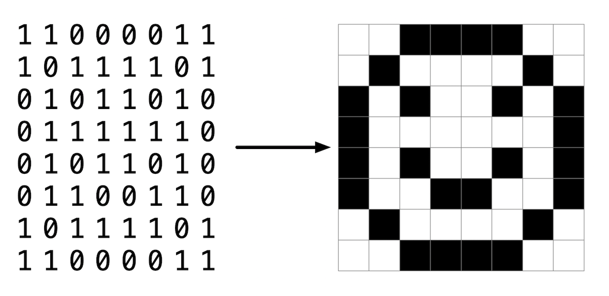

# Finish one of: Smiley or Volume

## Lab4: Smiley

## Learning Goals

- Learn how to work with images
- Practice manipulating pixels

## Background



You’ve seen in lecture a bit about how images are stored on a computer. In this lab, you’ll practice working with a BMP file, actually the smiley face pictured here, and change all the black pixels to a color of your choosing.

However, the smiley face you’ll be working with is not just made of of 0’s and 1’s, or black and white pixels, but consists of 24 bits per pixel. It uses eight bits to represent red values, eight bits for green and eight bits for blue. Since each color uses eight bits or one byte, we can use a number in the range of 0 to 255 to represent its color value. In hexadecimal, this is represented by `0x00` to `0xff`. By mixing together these red, green and blue values, we can create millions of possible colors.

If you look at `bmp.h`, one of the the helper files in the distribution code, you’ll see how each `RGB triple` is represented by a `struct` like:

```c
typedef struct
{
    BYTE rgbtBlue;
    BYTE rgbtGreen;
    BYTE rgbtRed;
}
RGBTRIPLE;
```

where `BYTE` is defined as an 8-bit integer.

You’ll notice several files provided in the distribution code to handle the reading and writing of an image file, as well as handling the image’s metadata or “headers”. You’ll be completing the function `colorize` in `helpers.c`, which already has as input parameters, the image’s height, width, and a two-dimensional array of `RGBTRIPLE’s` which create the image itself.

## Hints

If we were to save the first pixel as `RGBTRIPLE pixel = image[0][0]` we could then access each of the individual colors of `pixel` as `pixel.rgbtBlue`, `pixel.rgbtGreen`, and `pixel.rgbtRed`.

## Implementation Details

Open up `helpers.c` and notice that the `colorize` function is incomplete. Note that the image’s height, width and a two-dimensional array of pixels is set up as the input parameters for this function. You are to implement this function to change all the black pixels in the image to a color of your choosing.

You can compile your code by simply typing `make` at the `$` prompt.

You then execute the program by typing:

```bash
./colorize smiley.bmp outfile.bmp
```

where `outfile.bmp` is the name of the new bmp you are creating.

## Thought Question

- How do you think you represent a black pixel when using a 24-bit color BMP file?
- Is this the same or different when mixing paints to repesent various colors?

## How to Test Your Code

Your program should behave per the examples below.

```bash
./colorize smiley.bmp smiley_out.bmp
```

When your program is working correctly, you should see a new file, `smiley_out.bmp` in your `smiley` directory. Open it up and see if the black pixels are now the color you’ve specified.

## Lab4: Volume

Write a program to modify the volume of an audio file.

```bash
./volume INPUT.wav OUTPUT.wav 2.0
```

Where `INPUT.wav` is the name of an original audio file and `OUTPUT.wav` is the name of an audio file with a volume that has been scaled by the given factor (e.g., 2.0).

## WAV Files

WAV files are a common file format for representing audio. WAV files store audio as a sequence of “samples”: numbers that represent the value of some audio signal at a particular point in time. WAV files begin with a 44-byte “header” that contains information about the file itself, including the size of the file, the number of samples per second, and the size of each sample. After the header, the WAV file contains a sequence of samples, each a single 2-byte (16-bit) integer representing the audio signal at a particular point in time.

Scaling each sample value by a given factor has the effect of changing the volume of the audio. Multiplying each sample value by 2.0, for example, will have the effect of doubling the volume of the origin audio. Multiplying each sample by 0.5, meanwhile, will have the effect of cutting the volume in half.

## Types

So far, we’ve seen a number of different types in C, including `int`, `bool`, `char`, `double`, `float`, and `long`. Inside a header file called `stdint.h` are the declarations of a number of other types that allow us to very precisely define the size (in bits) and sign (signed or unsigned) of an integer. Two types in particular will be useful to us in this lab.

- `uint8_t` is a type that stores an 8-bit unsigned (i.e., not negative) integer. We can treat each byte of a WAV file’s header as a `uint8_t` value.
- `int16_t` is a type that stores a 16-bit signed (i.e., positive or negative) integer. We can treat each sample of audio in a WAV file as an `int16_t` value.

## Implementation Details

Complete the implementation of `volume.c`, such that it changes the volume of a sound file by a given factor.

- The program accepts three command-line arguments: `input` represents the name of the original audio file, `output` represents the name of the new audio file that should be generated, and `factor` is the amount by which the volume of the original audio file should be scaled.
  - For example, if `factor` is `2.0`, then your program should double the volume of the audio file in `input` and save the newly generated audio file in `output`.
- Your program should first read the header from the input file and write the header to the output file. Recall that this header is always exactly 44 bytes long.
  - Note that `volume.c` already defines a variable for you called `HEADER_SIZE`, equal to the number of bytes in the header.
- Your program should then read the rest of the data from the WAV file, one 16-bit (2-byte) sample at a time. Your program should multiply each sample by the `factor` and write the new sample to the output file.
  - You may assume that the WAV file will use 16-bit signed values as samples. In practice, WAV files can have varying numbers of bits per sample, but we’ll assume 16-bit samples for this lab.
- Your program, if it uses `malloc`, must not leak any memory.

## Hints

- You’ll likely want to create an array of bytes to store the data from the WAV file header that you’ll read from the input file. Using the `uint8_t` type to represent a byte, you can create an array of `n` bytes for your header with syntax like

```c
uint8_t header[n];
```

replacing `n` with the number of bytes. You can then use `header` as an argument to `fread` or `fwrite` to read into or write from the header.

- You’ll likely want to create a “buffer” in which to store audio samples that you read from the WAV file. Using the `int16_t` type to store an audio sample, you can create a buffer variable with syntax like

```c
int16_t buffer;
```

You can then use `&buffer` as an argument to `fread` or `fwrite` to read into or write from the buffer. (Recall that the `&` operator is used to get the address of the variable.)

- You may find the documentation for `fread` and `fwrite` helpful here.
  - In particular, note that both functions accept the following arguments:
    - `ptr`: a pointer to the location in memory to store data (when reading from a file) or from which to write data (when writing data to a file)
    - `size`: the number of bytes in an item of data
    - `nmemb`: the number of items of data (each of `size` bytes) to read or write
    - `stream`: the file pointer to be read from or written to
- Per its documentation, `fread` will return the number of items of data successfully read. You may find this useful to check for when you’ve reached the end of the file!

## How to Test Your Code

Your program should behave per the examples below.

```bash
$ ./volume input.wav output.wav 2.0
```

When you listen to `output.wav` (as by control-clicking on `output.wav` in the file browser, choosing **Download**, and then opening the file in an audio player on your computer), it should be twice as loud as `input.wav`!

```sh
$ ./volume input.wav output.wav 0.5
```

When you listen to `output.wav`, it should be half as loud as `input.wav`!
